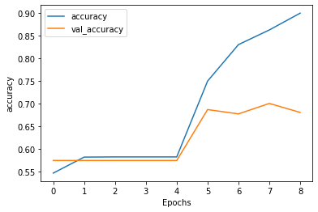
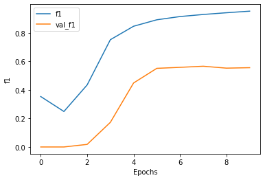

Authors: Joshua Zwiebel and Andrew Bury
# Disaster-Tweets
An exploration of the Kaggle disaster Tweets dataset and development of a predictive model. 
# Purpose
The goal of this repository and code was to create a model to compete in the Kaggle competition [Real or Not Disaster Tweets](https://www.kaggle.com/c/nlp-getting-started). More generally however the goal was to use the competition as an avenue to explore the field of NLP and gain some experience in working with natural language to produce models capable of producing real value.

# The Data

The data being processed was as follows (it can be found within the repository for further inspection). A single sample contains up to 3 data points
- The text of the tweet
- a keyword of the tweet (i.e ablaze)
- the location the tweet was sent from

They keyword and location of the tweet had the potential to be blank. The training data contained approx ~7000 samples with a 55-45 split between real and fake tweets. 

# Preprocessing
Preprocessing data is important to NLP as the most valuable information in text data can get confused or become difficult for a model to process if not made clean. Some important steps to consider using when preprocessing text data are lemmatizing and tokenizing which are the main tools used in our preprocessing. 

Lemmatizing breaks a word down to its root. This is the difference between "running" and "run". Breaking words down to their roots is valuable to a model because often the model does not need to be fed a sentence with perfect grammar in order to accomplish a given task such as sentiment analysis. Having fewer words to process and having more words in common has the potential to lead to better end performace in the model. 

Tokenizing is the process of breaking down text into individual units such as words, punctation and numbers. Tokenization is valuable because once it is done each word can be assigned a numeric value to feed into a model. A simple example would be turning `[there, was, a, black, cat, and, a, white, cat]` into `[0,1,2,3,4,5,6,2,7,4]`. Notice how cat is 4 in both cases and the new words appear as new numbers.

These were the main goals in preprocessing but further details can be found by reading our preprocessing scripts

# Models
1. **Naive Model**

The first goal of the project was to produce a naive model to be able to get a baseline performance to compare all other iterations to. The model contained multiple Bidirectional GRU layers. [Bidirectional](https://machinelearningmastery.com/develop-bidirectional-lstm-sequence-classification-python-keras/) layers can be helpful for tasks where the context of the full sentence can be used.  The model was able to get 70% percent accuracy on the validation set.

2. **Naive Iteration**

The second model was quite similar to first except some measures were taken to prevent overfitting. The Bidirectiopnal layers were told to implement dropout. A BatchNormalization layer was added which can contribute to preventing overfitting as well as a final dropout layer was added. This model achieved 73% accuracy on the validation set.

3. **BERT layer**

This iteration was one I was personally very excited about trying. BERT is the cutting edge in natural language processing. Instead of building a model from scratch the state of the art is to fine-tune existing models to fit your purpose. I used the [bert-for-tf2](https://github.com/kpe/bert-for-tf2) to accomplish this. Unfortunately I was not able to get promising results out of the model. Only 58% accuracy was achieved which is suspiciously close to the split between positive and negative test cases. This leads me to believe the model was not learning anything productive. I suspect some of the issues make came because of how I preprocessed the data. BERT required specifc tokens to be added at the beginning and end of samples which I forgot to do. However the process to getting the model to compile was an exciting one and taught me a lot about the state of NLP in 2020. [This]()https://www.kaggle.com/xhlulu/disaster-nlp-keras-bert-using-tfhub Kaggle notebook has a far more successful usage of BERT that I plan on testing with in the near future. 

4. **Wide and Deep**

This was the most successful iteration and the most valuable learning experience. I used the Keras Functional API to create a [Wide and Deep model](https://ai.googleblog.com/2016/06/wide-deep-learning-better-together-with.html). The inspiration towards this approach was that ignoring the location and keyword data entirely as had been done in previous iterations could possibly lead to missed information and insights. However the concern was that the patterns that could be found in the text data would be much more complex than would be found in a single keyword. This is ignoring the issue of having to deal with data coming from two different sources. The solution was to feed the text data through the deep part of the model and the keywords would be fed in through the shallow wide part. The maximum accuracy achieved in this case was 72%. It was at this point that I decided that there were better metrics for evaluating model performance than accuracy especially with a skewed dataset. [F1](https://en.wikipedia.org/wiki/F1_score) is a very valuable metric when looking at binary classification performance. It is the harmonic mean of precision and recall (you can read more about both on the previous link).

This means it would be much more liable to report lower results if the model was skewing towards assigning false positives or false negatives. It also gave me some experience with using custom metrics in the keras Functional API. The validation F1 was 0.56, which is significantly lower than the accuracy but also a much more valuable value to understand when evaluating the model.

# Resources and Learning
[Good tutorial for beginning nlp preprocessing](https://towardsdatascience.com/nlp-for-beginners-cleaning-preprocessing-text-data-ae8e306bef0f)

[Using spacy for preproccessing](https://stackabuse.com/python-for-nlp-tokenization-stemming-and-lemmatization-with-spacy-library/)

# Results 

# Future Work
I would like to change the way the BERT layer was constructed. The results that were obtained from BERT were disappointing but have the potential to be much more with further bug testing. Additionally, I would like to try other preprocessing techniques in the hopes that cleaning the data further will lead to better results. 
# How to use any of the Code
Install the requirements.txt and start running the notebooks! If you encounter any issues please post an issue or email me and jjzwiebe@edu.uwaterloo.ca
